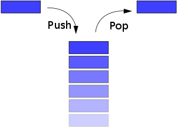

# Stack
> 由于栈是线性表，因而栈有两种存储形式分别为**链式结构**和**顺序结构**
> 。顺序存储的链表又称为顺序栈，链式存储的链表又称链序栈
> 1.栈的顺序存储实现
> >- 栈的顺序结构存储通常使用一个一维数组，和一个记录栈顶的变量组成
> >- 一个变量来存储堆栈的最大容量MaxSize



## 1._**顺序存储**_
```c++
typedef int Position;
typedef int ElementType;
typedef struct SNode * PtrToSNode;
struct SNode
{
    ElementType *Data; //存储数组元素 (Storing array elements) 
    Position Top; //表示当前栈顶元素的下标值(Represents the subscript value of the current top element on the stack)
    int MaxSize;  //存储表示堆栈的最大容量(Storage represents the maximum capacity at the top of the stack)
};
typedef PtrToSNode Stack;
```
>>- _顺序栈的创建_ `CreatStack()`
```c++
Stack CreateStack(int MaxSize) //生成一个空的堆栈，其最大长度为MaxSize
{
    Stack S;
    S = (Stack)malloc(sizeof(struct SNode));
    S->Data = (ElementType*)malloc(sizeof(ElementType) * MaxSize);
    S->Top = -1;
    S->MaxSize = MaxSize;
    return S;
}
```


>>-  _判断堆栈是否已经满了_ `IsFull()`
```c++
bool IsFull(Stack S,int MaxSize) //判断堆栈是否是满的
{
    return (S->Top == MaxSize - 1);
}
```

>>- _向堆栈中推入元素_ `Push()`
```c++
bool Push(Stack S,ElementType X) //将元素X压入栈底。若堆栈已满，返回false，否则将元素X插入栈顶返回true
{
    if(IsFull(S, SIZE)){
        printf("堆栈已满\n");
        return false;
    }
    S->Data[++(S->Top)] = X;
    return true;

}
```
>>- _删除堆栈中的元素_ `Pop()`
```c++
ElementType Pop(Stack S)//删除并返回栈顶元素
{
    if(IsEmpty(S)){
        printf("堆栈为空\n");
        return false;
    }
    else{
        return S->Data[(S->Top)--];
    }
}
```

>>- _判断堆栈中是否为空_ `IsEmpty()`
```c++
bool IsEmpty(Stack S) //判断堆栈是否为空，若是返回true，否则返回false
{
    return (S->Top == -1);
}
```
> 有的时候我们可能希望知道栈顶的值，而不去删除它，这个时候我们就需要有一个`peek()`函数

>>- _查看栈顶的元素_ `Peek()`
```c++
ElementType Peek(Stack S) //查看栈顶的元素 
{
    if(IsEmpty(S)) return -1;
    return S->Data[S->Top];
}
```

## 2.链式存储
```c++
typedef int ElementType;
typedef struct SNode* PtrToSNode;
struct SNode {
    ElementType Data;
    PtrToSNode next;
};
typedef PtrToSNode Stack;
```
> 链式存储的模板一并给出
```c++
#include <stdio.h>
#include <stdlib.h>
#include <stdbool.h>
#define error -1

typedef int ElementType;
typedef struct SNode* PtrToSNode;
struct SNode {
    ElementType Data;
    PtrToSNode next;
};
typedef PtrToSNode Stack;

Stack CreatStack();//创建一个链式堆栈
bool IsEmpty(Stack S); //判断堆栈空不空
bool Push(Stack S, ElementType x);//将元素压入堆栈中
ElementType Pop(Stack S);//删除栈顶的元素，并返回值

int main() {
    return 0;
}

Stack CreatStack() //创建一个链式堆栈
{
    Stack S;
    S = (Stack)malloc(sizeof(struct SNode));
    S->next = NULL;
    return S;
}
bool IsEmpty(Stack S) //判断堆栈空不空
{
    return S->next == NULL;
}
bool Push(Stack S, ElementType x) //将元素压入堆栈中
{
    PtrToSNode tmp;
    tmp = (Stack)malloc(sizeof(struct SNode));
    tmp->Data = x;
    tmp->next = S->next;
    S->next = tmp;
    return true;
}
ElementType Pop(Stack S) //删除栈顶的元素，并返回值
{
    PtrToSNode tmp;
    ElementType topelment;
    if(IsEmpty(S)) return error;
    else {
        tmp = S->next;
        topelment = tmp->Data;
        S->next = tmp->next;
        free(tmp);
        return topelment;
    }
}

```


