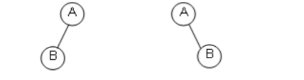

# 树  

## 树的定义

> 树（Tree）：n个节点构成的有限的集合。当 n = 0时，称为空树；对于任意一颗非空树（n > 0），则它具有一下性质：
>> - 树中有一个称为“ 根 ”的特殊节点用 r 表示；
>> - 其余节点可以分为 m 个互不相交的有限集合T1，T2....Tn，其中每个集合本身又是一棵树，称为原来树的 “ 子树 ”。


## 树的一些基本术语  
>1. **节点的度**（Degree）：节点的子树个数  
>2. **树的度** ：树的所有节点中最大的度数
>3. **叶节点（Leaf）** ：度为零的节点
>4. **父节点（Parent）**：有子树的节点是其子树的根节点的父节点
>5. **子节点（Child）**：若 *A* 是 *B* 的父节点，则 *B* 是 *A* 的子节点
>6. **兄弟节点（Sibling）**: 具有**同一父节点**的各个节点彼此之间是兄弟节点
>7. **路径和路径长度**：从节点 *n1* 到 *nk* 的路径为一个节点序列，*ni* 是 *ni+1的父节点。路径所包含边的个数为 **路径的长度**。
>8. **祖先节点（Ancestor）**：沿着树根到某一结点路径上所有节点都是**末尾这个叶节点**的祖先节点。
>9.**子孙节点（Descendant）**：某一结点的**子树**上所有的节点都是这一节点的子孙节点
>10. **节点的层次（Level）**：规定根节点的层数为 *1* 层其他任意节点的层数为其**父节点的层数加一**
>11. **树的深度（Depth）**：树中所有节点中的**最大层次**就是这颗树的最大层


# 二叉树

> 二叉树是一个又穷的节点集合，这个集合可以为空，若不为空，则它是由 **根节点** 和称其为 **左子树** 和 **右子树** 的两个互不相交的二叉树组成。
> - 二叉树有具体的五种基本形态
> 
> -二叉树也有左右之分
> 

## 特殊的二叉树

> **斜二叉树（Skewed Binary Tree）**
> 
>> 斜二叉树的结构最差，它已经退化为线性表了
>> 
> **完美二叉树（perfectBinaryTree）**
> -所有分支节点都存在左子树和右子树，并且所有叶节点都在同一层上
> 
>> 
> **完全二叉树（CompleteBinaryTree）**
> -有n个节点的二叉树，对树中结点按从上自下，从左自右顺序进行编号，编号为 *i* 的结点与满二叉树中编号 *i* 结点在二叉树中位置相同

### 二叉树的遍历方法

#### 二叉树的递归遍历
> 二叉树中序遍历
```C
void PreOrderTraversal(BinTree BT)
{
    if(BT){
        PreOrderTraversal(BT->Left);
        printf("%d\n",BT->Data);
        PreOrderTraversal(BT->right);
    }
}
```
> 二叉树中的先序遍历
```C
void PreOrderTraversal(BinTree BT)
{
    if(BT){
        printf("%d\n",BT->Data);
        PreOrderTraversal(BT->Left);
        PreOrderTraversal(BT->right);
    }
}
```
> 二叉树中的后序遍历
```C
void PreOrderTraversal(BinTree BT)
{
    if(BT){
        PreOrderTraversal(BT->Left);
        PreOrderTraversal(BT->right);
        printf("%d\n",BT->Data);
    }
}
```

#### 二叉树的非递归遍历

```C
void InOrderTraversal(BinTree BT)
{
    BinTree T;
    Stack S = CreatStack(); //创建一个空的堆栈
    T = BT;
    while( T || !IsEmpty(S) ){
        while( T ){
            Push(S,T);
            T = T->Left;
        }
        T = Pop(S);
        printf("%d",T->Data);
        T = T->Right
    }
}
```
